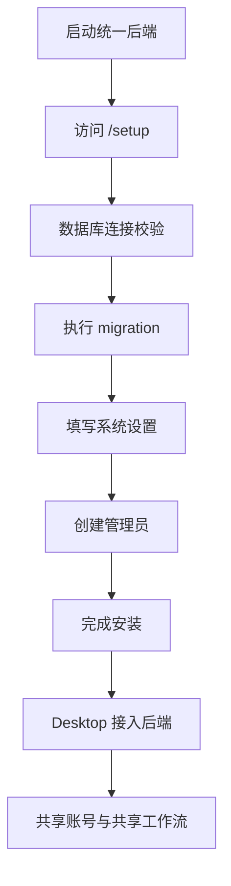

# Libra 开源初始化与后端收口方案

## 文档目标

本文档定义 Libra 当前开源版本的初始化、后端归口和 Desktop 接入边界。目标不是再维护一套 Web 管理台，而是把首装入口和服务契约收敛到足够简单的形态。

当前已经确定的架构约束：

- `apps/web` 已删除，不再承担任何初始化或管理功能
- 初始化页面嵌入统一后端，并通过 `/setup` 直接提供
- 对外只暴露一个后端地址
- Desktop 可以完全脱离后端独立运行
- 接入后端后，Desktop 才使用共享账号、共享工作流和初始化状态

## 目标

Libra 作为开源项目，需要做到：

1. 用户拿到仓库后，只需要启动一个后端入口。
2. 用户直接访问后端提供的 `/setup` 完成初始化。
3. Desktop 不依赖后端也能工作。
4. Desktop 后续可以在设置中接入后端。
5. 任何人如果要用其他语言重写后端，可以优先读取结构化契约文档，而不是先读 Go 源码。

## 当前架构

### 前端

当前只保留 `apps/desktop`：

- 负责工作台与管理台能力
- 默认以本地模式运行
- 可选接入后端
- 若后端未初始化，可提示用户打开 `/setup`，也允许继续本地模式

### 后端

当前后端是单一 Go module，主入口为：

```bash
cd services
go run ./cmd/server
```

统一后端在同一地址上暴露三个领域：

- `account`
- `runtime`
- `setup`

路由归口如下：

- `/auth/v1/*` -> `account`
- `/workflow/v1/*` -> `runtime`
- `/setup` 与 `/setup/v1/*` -> `setup`

### 初始化页面

初始化页面已经嵌入后端：

- `GET /setup`

因此，开源仓库不再需要也不应该重新引入 `apps/web`。

## Desktop 与后端的关系

Desktop 的目标是“本地优先、后端可选”。

### 不接后端

在不接后端时：

- Desktop 直接进入本地模式
- 用户、身份、权限和工作流使用本地存储
- 不检查 `/setup/v1/status`
- 不依赖任何服务器能力

### 接入后端

在接入后端时：

- Desktop 只配置一个后端地址，例如 `http://127.0.0.1:10001`
- Desktop 通过同一地址访问：
  - `/auth/v1/*`
  - `/workflow/v1/*`
  - `/setup/v1/*`
- 如果后端未初始化，会显示引导页：
  - 打开 `/setup`
  - 或切回本地模式

这意味着 Desktop 从始至终不承担初始化实现本身，只负责消费初始化状态。

## 初始化流程

推荐的初始化路径：



## 初始化步骤

### 1. 数据库连接校验

校验字段：

- 数据库类型
- Host
- Port
- User
- Password
- Database
- SSL Mode

首期建议只支持 PostgreSQL。

### 2. 数据库迁移

迁移负责创建初始化元数据表，并写入当前安装版本需要的基础结构。

### 3. 系统设置

系统设置建议至少包含：

- 站点名称
- 平台访问地址
- 默认语言
- 时区
- 是否允许公开注册

### 4. 创建管理员

管理员字段建议至少包含：

- 姓名
- 邮箱
- 密码
- 确认密码
- 初始工作区名称

### 5. 完成安装

完成动作包括：

- 标记初始化已完成
- 写入安装时间
- 写入安装版本
- 记录管理员 ID
- 写入系统配置摘要

## 初始化状态模型

初始化状态应当是显式状态，而不是通过“有没有管理员”去猜。

建议最少包含：

- `setupStatus`
- `currentStep`
- `installed`
- `installedAt`
- `installedVersion`
- `adminUserId`
- `systemConfig`
- `lastError`

建议状态值：

- `pending`
- `database_ready`
- `system_ready`
- `admin_ready`
- `completed`
- `failed`

## 初始化接口

当前统一后端已定义：

```text
GET  /setup
GET  /setup/v1/status
POST /setup/v1/database/validate
POST /setup/v1/database/migrate
POST /setup/v1/system-config
POST /setup/v1/admin
POST /setup/v1/finalize
```

这些接口的精确字段定义不在本文重复维护，统一以 `services/contracts/setup.yaml` 为准。

## 结构化契约文档

为了让其他语言实现者可以直接按契约重写，仓库内新增：

- `services/contracts/backend.yaml`
- `services/contracts/account.yaml`
- `services/contracts/runtime.yaml`
- `services/contracts/setup.yaml`

这些文档覆盖：

- 服务结构
- 路由与参数
- 响应包格式
- 环境变量
- 本地文件存储结构
- 初始化使用的数据库元数据表
- 启动方式与单地址归口

规则：凡是后端代码改动涉及以下内容，必须同步修改契约文档：

- HTTP 路由
- 参数或响应字段
- 错误语义
- 环境变量
- 文件存储结构
- 数据库结构
- 目录结构
- 启动方式

## README 的目标结构

README 需要始终保持以下原则：

1. 快速开始只写一个后端入口：`go run ./cmd/server` 或启动脚本。
2. 初始化入口只写一个地址：`http://127.0.0.1:10001/setup`。
3. 不再描述 `apps/web`。
4. 明确说明 Desktop 可以不接后端直接使用。
5. 明确指向 `services/contracts` 作为跨语言实现说明。

## 分阶段实施

### P0

目标：完成单地址后端和初始化页面内嵌。

已完成：

- 删除 `apps/web`
- 初始化页面嵌入后端 `/setup`
- 后端统一到单一地址
- Desktop 切换到单地址配置模型
- 建立 `services/contracts` 契约目录

### P1

目标：继续收口 Desktop 管理能力。

范围：

- 继续把剩余管理链路迁到 Desktop
- 把 Desktop 与后端共享能力做得更明确
- 整理本地模式与远端模式切换体验

### P2

目标：完善开源安装体验。

范围：

- 前端依赖公开化安装方案
- 部署示例
- 配置模板
- 更多语言实现示例

## 推荐执行顺序

建议后续按这个顺序推进：

1. 继续完善 Desktop 管理台。
2. 稳定 `services/contracts`，让它真正可作为二次实现规范。
3. 再处理公开安装依赖和部署样例。

当前不建议回到“双前端入口”或“多后端地址”模式，因为那只会重新引入不必要的复杂度。
